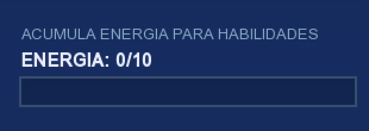
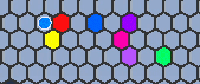
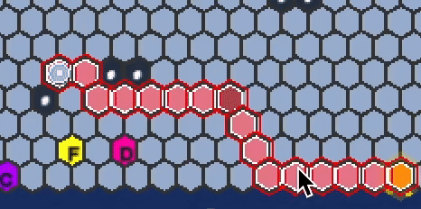
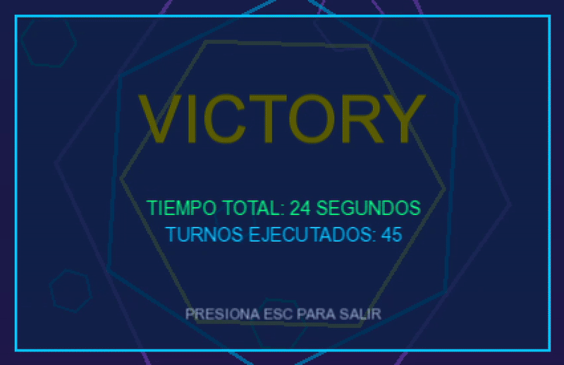

# HexEscape 🏭⚡

## Descripción General

Bienvenido a **HexEscape**, fábrica de rompecabezas. En este juego te pones en la piel de un ingeniero atrapado en una fábrica automatizada futurista, intenta escapar en el menor tiempo posible. Usa tu poder 'energía destructiva' para demoler obstáculos y paredes que bloquean tu camino, aprovecha las bandas transportadoras estratégicamente distribuidas por el mapa hexagonal para moverte más rápido, y bate tu récord personal mientras resuelves cada nivel con la máxima eficiencia.

Cada decisión cuenta: ¿gastas tu valiosa energía para abrir un atajo directo, o prefieres tomar la ruta más larga pero segura? El tiempo corre y la fábrica no espera.

## Instrucciones de Compilación

### Requisitos Previos
- **CMake** versión 3.27.8 o superior
- **Compilador C++17** compatible
- **Git** para descargar dependencias

### Método 1: Visual Studio Code 

1. **Configuración inicial** (solo una vez):
   - Abre la carpeta del proyecto en VSCode
   - Instala la extensión "CMake Tools" si no la tienes
   - Presiona `Ctrl+Shift+P` (o `Cmd+Shift+P` en macOS)
   - Ejecuta "CMake: Configure" y selecciona tu compilador

2. **Compilar y ejecutar**:
   - **Compilar**: Presiona `F7` o usa el ícono ⚙️ en la barra inferior
   - **Ejecutar**: Presiona `Shift+F5` o usa el ícono ▶️ en la barra inferior

### Método 2: Línea de Comandos

```bash
# Navegar al directorio del proyecto
cd sfml/

# Crear y configurar build
mkdir build
cd build
cmake ..

# Compilar
cmake --build .

# Ejecutar
./main          # Linux/macOS
main.exe        # Windows
```

**Compilación rápida en una línea:**
```bash
cmake -B build && cmake --build build && ./build/main
```

## Cómo Jugar

HexEscape se desarrolla en un mapa hexagonal único que te ofrece **6 direcciones de movimiento**, a diferencia de los juegos tradicionales de 4 direcciones. Esta mecánica hexagonal abre nuevas posibilidades estratégicas y rutas de escape.

### Objetivo
Tu misión es escapar de cada nivel de la fábrica en el menor tiempo posible, utilizando:

- **Movimiento estratégico** por las celdas hexagonales
- **Energía destructiva** para romper paredes y crear nuevos caminos
- **Bandas transportadoras** para acelerar tu movimiento
- **Planificación de rutas** para optimizar tu escape

### Mecánicas del Juego
- **Sistema de energía**: Gestiona cuidadosamente tu energía limitada para romper obstáculos

- **Bandas transportadoras**: Úsalas estratégicamente para moverte más rápido por el mapa

- **Pathfinding inteligente**: El juego puede mostrarte la ruta óptima si necesitas ayuda

- **Sistema de tiempo**: Cada segundo cuenta para batir tu mejor marca


## Controles

### Movimiento Hexagonal
El mapa hexagonal te permite moverte en 6 direcciones:

- **`W`** - Arriba a la izquierda ↖️
- **`E`** - Arriba a la derecha ↗️
- **`A`** - Izquierda ⬅️
- **`D`** - Derecha ➡️
- **`Z`** - Abajo a la izquierda ↙️
- **`X`** - Abajo a la derecha ↘️

### Acciones Especiales
- **`ESPACIO`** - Usar energía destructiva para romper paredes (requiere energía suficiente)
- **`P`** - Mostrar/ocultar el camino óptimo hacia la salida
- **`R`** - Ejecutar automáticamente el camino óptimo
- **`ESC`** - Cancelar acción actual o pausar juego

### Consejos de Jugabilidad
- Usa las bandas transportadoras para ahorrar tiempo
- Si te quedas atascado, usa `P` para ver la ruta óptima
- Practica el movimiento hexagonal para mejorar tu velocidad
